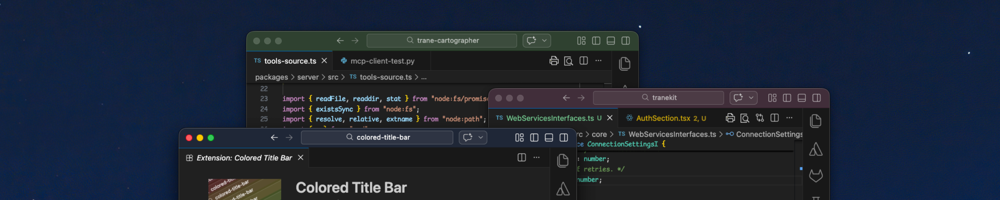

# Colored Title Bar

[](https://github.com/wstuckey/colored-title-bar/actions/workflows/ci.yml)
[](https://marketplace.visualstudio.com/items?itemName=wstuckey.colored-title-bar)

**Give every workspace its own color.** Colored Title Bar assigns a unique, visually appealing color to your VS Code title bar so you can instantly tell which project you're in — no more guessing across a dozen open windows.



---

## Why?

If you juggle multiple VS Code windows throughout the day, they all look the same. Colored Title Bar fixes that with a single install — each workspace automatically gets a distinct, deterministic color the first time you open it, and you can randomize or hand-pick colors whenever you like.

## Features

- **Automatic per-workspace color** — every folder gets a unique, stable color on first open. No configuration needed.
- **Randomize** — one command generates a fresh, pleasing color adapted to your current theme.
- **Pick a color family** — choose from 14 named presets: Red, Orange, Amber, Yellow, Lime, Green, Teal, Cyan, Blue, Indigo, Purple, Magenta, Pink, and Rose.
- **Always readable** — foreground text (white or black) is chosen using WCAG 2.0 contrast ratios, so icons and labels stay crisp.
- **Theme-aware** — works beautifully with Dark, Light, and High Contrast themes.
- **Non-destructive** — only title bar keys are touched; all your other color customizations are safe.
- **Reset anytime** — one command removes all overrides and restores defaults.

## Getting Started

1. **Install** from the [VS Code Marketplace](https://marketplace.visualstudio.com/items?itemName=wstuckey.colored-title-bar) or search "Colored Title Bar" in the Extensions view.
2. **Open a folder** — a color is assigned automatically.
3. **Want a different color?** Open the Command Palette (`Cmd+Shift+P` / `Ctrl+Shift+P`) and run one of the commands below.

## Commands

| Command | Description |
|---------|-------------|
| **Colored Title Bar: Randomize Color** | Apply a new random color. |
| **Colored Title Bar: Pick Color Family** | Choose a hue family from a quick-pick list. |
| **Colored Title Bar: Reset to Default** | Remove all title-bar overrides and restore defaults. |

## Settings

| Setting | Type | Default | Description |
|---------|------|---------|-------------|
| `coloredTitleBar.colorOnStartup` | `boolean` | `false` | Apply a fresh random color every time VS Code starts. |

## How It Works

1. A hue is selected — either randomly, from a preset, or deterministically from your workspace path.
2. Saturation and lightness are tuned to look great for the active theme (Dark, Light, or High Contrast).
3. The foreground color is picked for maximum readability using the WCAG 2.0 contrast ratio (≥ 4.5 : 1).
4. Inactive-window variants are derived with slightly reduced saturation and foreground opacity.
5. A subtle border is generated darker than the background.
6. All values are written to your workspace's `workbench.colorCustomizations` — nothing else is touched.

> **Note:** Colors are stored in your workspace settings (`.vscode/settings.json`). If you uninstall the extension, run **Reset to Default** first to clean up, or manually remove the `titleBar.*` entries.

## Development

```bash
npm install          # install dependencies
npm run compile      # one-shot build
npm run watch        # incremental build
npm run lint         # ESLint
npm run test         # compile + unit tests (mocha)
```

### Building from source

```bash
git clone https://github.com/wstuckey/colored-title-bar.git
cd colored-title-bar
npm install
npm run compile
```

Press **F5** to launch the Extension Development Host.

### Packaging a VSIX

```bash
npx @vscode/vsce package
code --install-extension colored-title-bar-*.vsix
```

## Contributing

Contributions are welcome! Please open an issue or pull request.

1. Fork the repository.
2. Create a feature branch (`git checkout -b feat/my-feature`).
3. Commit your changes with clear messages.
4. Open a pull request against `main`.

## License

[MIT](LICENSE)
